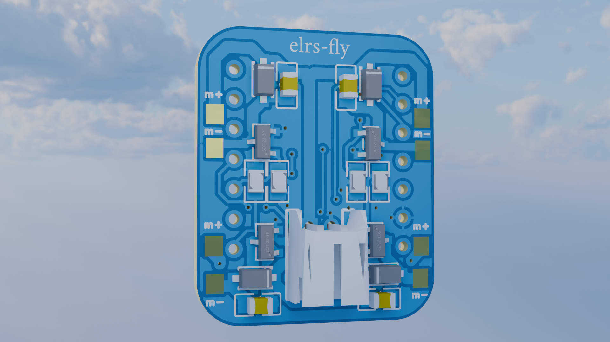
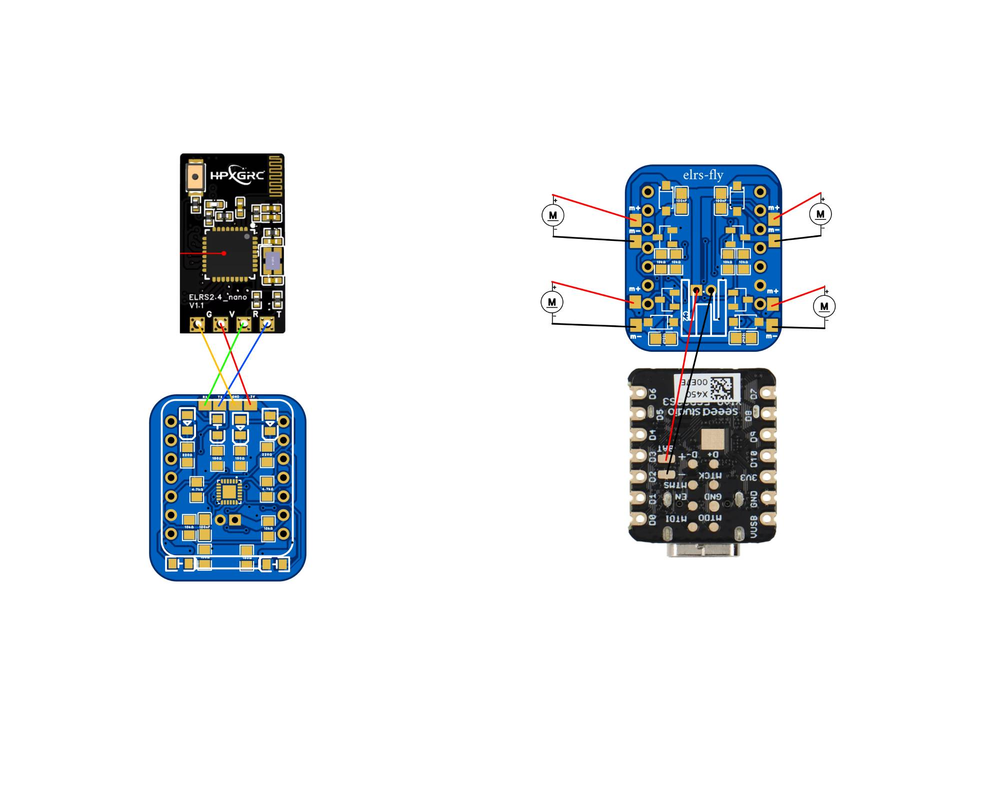

# ELRS-FLY

**ELRS-FLY** is a compact brushed flight controller with native **ExpressLRS** support.  

---

## Controller

ELRS-FLY is intended for small brushed drones and experimental builds.  
It integrates motor drivers, an IMU, and ExpressLRS compatibility on a single compact PCB.

---

## Features

- 4× brushed motor drivers  
- MPU9250 IMU (gyro)  
- XIAO ESP32-S3  
- Battery connector  
- Indicator LEDs  
- LEDs for drone visibility  

---

## Setup

Setup is simple:

1. Solder all required components onto the PCB.
2. Bridge the **battery pads** of the ESP32-S3 with the controller  
   (see wiring diagram below).
3. Connect and solder the **XIAO ESP32-S3** to the PCB using pin headers.
4. Solder a **2.4 GHz ExpressLRS receiver**  
   - Buy a ready-made receiver  
   - Or build one: https://www.expresslrs.org/hardware/special-targets/diy-rx/
5. Flash firmware using the awesome **esp-fc guide**:  
   https://github.com/rtlopez/esp-fc/tree/master?tab=readme-ov-file

---

## Wiring

---

## Firmware

This controller is designed to run:

- **esp-fc**  
  https://github.com/rtlopez/esp-fc

Refer to the esp-fc documentation for:
- Flashing
- Receiver configuration
- Calibration
- PID tuning

---

## PCB

### Front side

### Back side

## Credits

- esp-fc firmware by **rtlopez**  
- ExpressLRS community  
