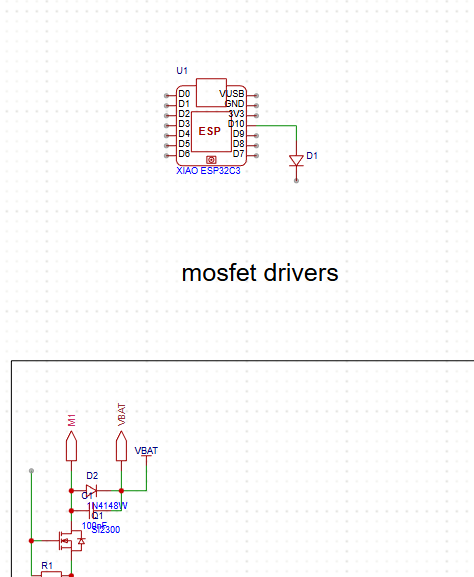
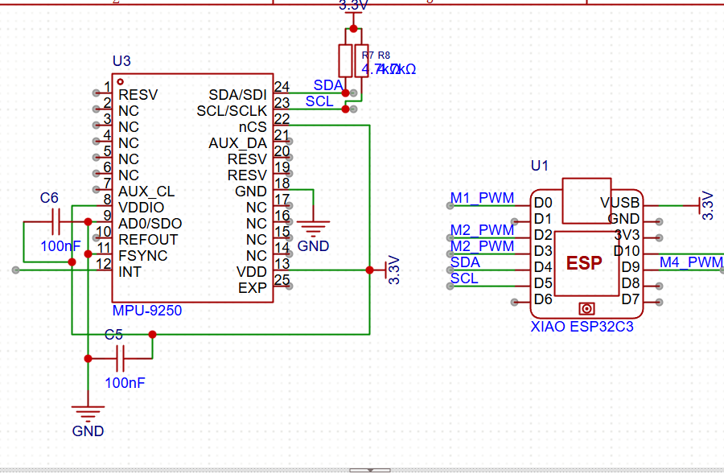
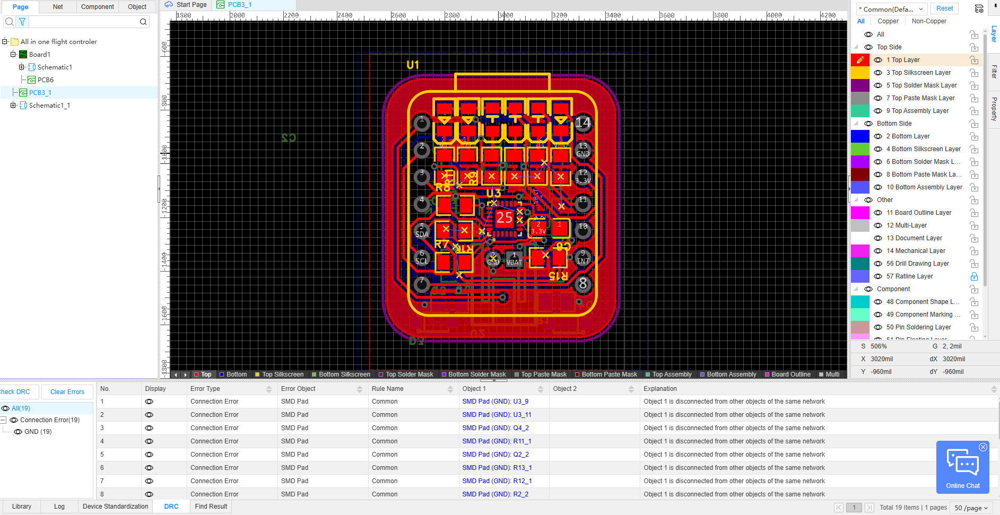
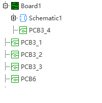

## Project Journal

### Total time spent: 39 hours

---

### 1.12.25 (time spent: 4 hours)
- Found out about Hack Club Blueprint and started researching what I could build.

---

### 4.12.25 (time spent: 8.5 hours)
- Started working on the schematic.
- I had a few options to decide on, such as whether to use brushed or brushless motors, which LEDs to pick, and other component choices.

---

### 5.12.25 (time spent: 3 hours)
- Finished working on the schematic and moved on to making the PCB.
- This turned out to be a big mistake, because I had to redo it a few days later.

---

### 5.12.25 – 12.12.25 (time spent: 18.25 hours)
- After many versions of the PCB, I finally got it into a usable state.
- I had to reroute the PCB many times because it was never good enough in earlier versions.

---

